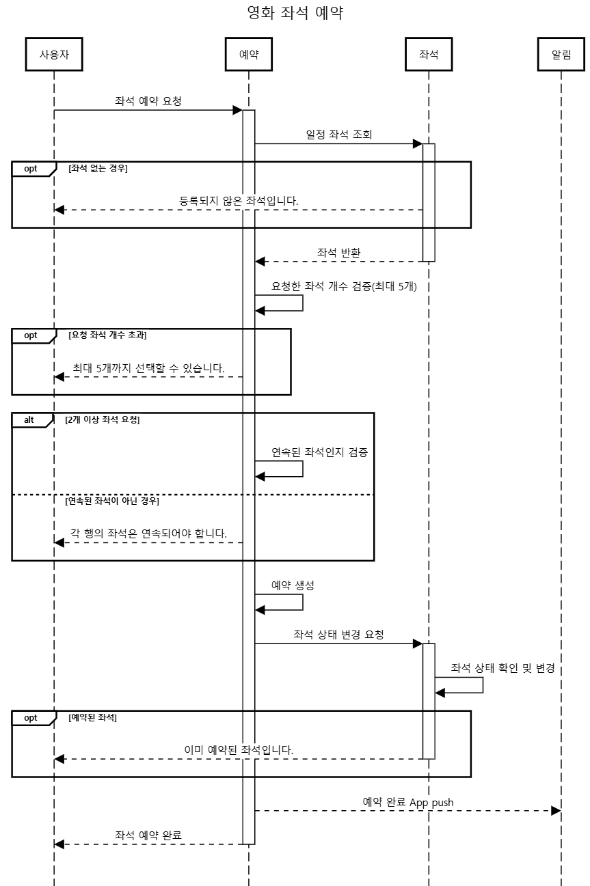

## 목차

* [Architecture](#Architecture)
* [멀티 모듈 설계](#멀티-모듈-설계)
* [ERD](#erd)
* [시퀀스 다이어그램](#시퀀스-다이어그램)
* [성능 테스트](#성능-테스트)
* [트러블 슈팅](#트러블-슈팅)

## Architecture
- **Clean + Layered**
- 기본적인 계층 구조를 유지하면서 비즈니스 중심 구조로 설계.
- Repository 인터페이스를 비즈니스 계층에 정의하고, infra 계층에서 이를 구현하여 DIP 적용.

## 멀티 모듈 설계

### movie-common
- 예외 처리 및 프로젝트 빈 설정.
- 프로젝트 전반에 사용되는 기능 처리.

### movie-api
- 클라이언트와의 인터페이스를 담당.
- 클라이언트 요청을 moive-application 모듈로 전달.

### movie-application
- 유즈케이스 역할 수행.
- 여러 도메인 서비스를 조합하여 비즈니스 처리.

### movie-business
- 비즈니스 규칙을 정의하고, 도메인 로직 수행.
- movie-application에 필요한 서비스를 제공.

### movie-infrastructure
- 외부 연동 관련 로직 처리 (HTTP, Message 등)
- 데이터 저장소 및 외부 API 연동.

## ERD
- 작성자,수정자,작성일,수정일 컬럼은 실제 테이블에 추가됩니다.  
  가독성을 위해 ERD 상에서만 제외했습니다.
- 테이블 간의 느슨한 결합을 위해 논리적 FK만 맺도록 했습니다.

### Movie(영화) & Theater(상영관) → N : N
- Theater-Schedule 을 두어 1:N 으로 풀어냄.

### Theater-Schedule(상영 일정) & Seat(좌석) →  1 : N
- **상영 일정(ID)마다 좌석이 개별적으로 관리됨.**
  - 같은 장소, 같은 좌석 번호(seat_number)를 갖고 있더라도 **상영 일정이 다르면 다른 좌석으로 취급**됨.

### Seat(좌석) & Reservation(예약) → N : 1
- 좌석은 해당 **상영 일정에서 단 한 번만 예약될 수 있음.**
  - 한 좌석을 두 명이 동시에 예약할 수 없음.
  - 상영 일정이 지나면 해당 좌석은 예약할 수 없어야 함.
- 최대 5개의 좌석까지 예약 가능.
  - 예약된 좌석은 RESERVED 상태로 변경되고, 예약ID를 가지고 있음.

### User(사용자) & Reservation(예약) → 1 : N
- 한 좌석에 대한 예약 내역은 반드시 하나지만, 한 명의 사용자가 여러 좌석을 예약할 수 있음.

## 시퀀스 다이어그램

<b>영화 목록 조회</b>

<b>영화 좌석 예약</b>

## 성능 테스트
- [인덱스 & 캐시 성능 테스트](/docs/index_cache_performance_test.md)
- [분산락 성능 테스트](/docs/distributed_lock_performance_test.md)

## 트러블 슈팅
- [영화 조회 시 N + 1 문제 발생](docs/troubleshoot/n_plus_one.md)
- [JPA 연관관계 설정에 대한 의문](docs/troubleshoot/JPA_연관관계_설정에_대한_의문.md)